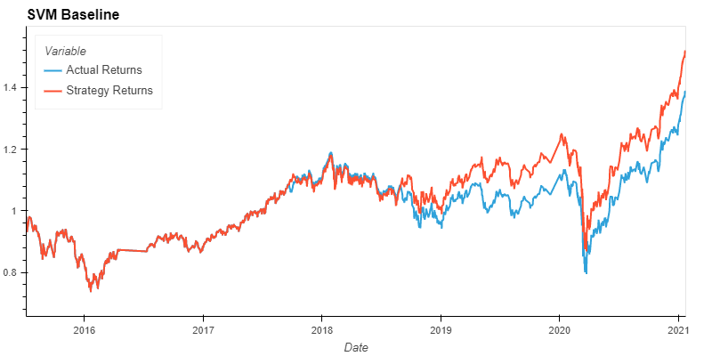
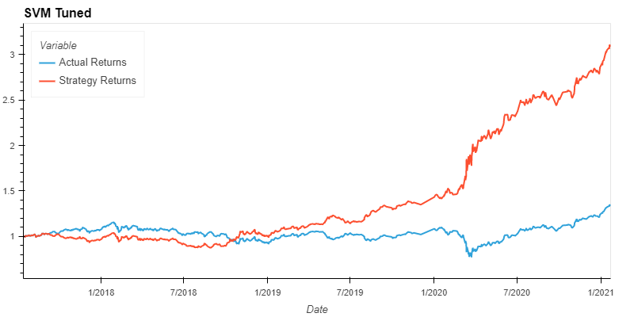
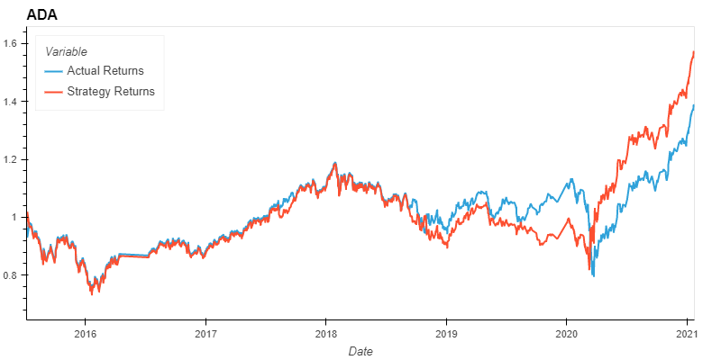

# ML-Algo-Trading

## Background

For this Challenge, you’ll assume the role of a financial advisor at one of the top five financial advisory firms in the world. Your firm constantly competes with the other major firms to manage and automatically trade assets in a highly dynamic environment. In recent years, your firm has heavily profited by using computer algorithms that can buy and sell faster than human traders.

The speed of these transactions gave your firm a competitive advantage early on. But, people still need to specifically program these systems, which limits their ability to adapt to new data. You’re thus planning to improve the existing algorithmic trading systems and maintain the firm’s competitive advantage in the market. To do so, you’ll enhance the existing trading signals with machine learning algorithms that can adapt to new data.

## What You're Creating

* Implement an algorithmic trading strategy that uses machine learning to automate the trade decisions.
    
* Adjust the input parameters to optimize the trading algorithm.
    
* Train a new machine learning model and compare its performance to that of a baseline model.

### Establish a Baseline Performance

*The provided CSV file contains open, high, low, close, and volume (OHLCV) data for a Morgan Stanley Capital International (MSCI)–based emerging markets exchange-traded fund (ETF) that [iShares](https://www.ishares.com/us/products/268704/ishares-currency-hedged-msci-emerging-markets) issued. Investments in emerging markets make up an important aspect of a well-diversified investment portfolio. That’s because the included equities have potentially higher long-term returns, even though they carry more risk.*

1.  Use the `SVC` classifier model from the SKLearn support vector machine (SVM) learning method to fit the training data and make predictions based on the testing data. Review the predictions.
    
2.  Review the classification report that’s associated with the `SVC` model predictions.
    
3.  Create a predictions DataFrame that contains “Predicted”, “Actual Returns”, and “Strategy Returns” columns.
    
4.  Create a cumulative return plot that shows the actual returns vs. the strategy returns.

#### Default Parameters

* <code>months_offset = 3</code>
* <code>short_win = 4</code>
* <code>long_win = 100</code>

### Tune the Baseline Trading Algorithm

In this section, you’ll tune, or adjust, the model’s input features to find the parameters that result in the best trading outcomes. (You’ll choose the best by comparing the cumulative products of the strategy returns.) To do so, complete the following steps:

1.  Tune the training algorithm by adjusting the size of the training dataset. To do so, slice your data into different periods. Rerun the notebook with the updated parameters, and record the results in your `README.md` file.
    
2.  Tune the trading algorithm by adjusting the SMA input features. Adjust one or both of the windows for the algorithm. Rerun the notebook with the updated parameters, and record the results in your `README.md` file.

#### Tuned Parameters

* <code>months_offset = 24</code>
* <code>short_win = int(months_offset * 30 * 0.17)</code>
* <code>long_win = int(months_offset * 30 * 0.35)</code>

### Evaluate a New Machine Learning Classifier

1.  Import a new classifier. `AdaBoost` was chosen.
    
2.  Using the original training data as the baseline model, fit another model with the new classifier.
    
3.  Backtest the new model to evaluate its performance.
    
## Summary

### Baseline SVM Model

This baseline model performed well enough to produce a return that is greater than the actual return of the ETF, however it is not significantly better.

### Tuned SVM Model

After tuning, the model performed significantly better than the untuned model. Changing the training window and SMA windows did change the performance of the model, but they did not seem to change it in a linear or a direct manner. For example, increasing or decreasing these values could produce better or worse results while moving one variable in the same direction. For this reason, it was decided to calculate the SMA windows based on the <code>months_offset</code> variable and adjust the calculation parameters to determine the final parameters used by the model.

* <code>months_offset = 24</code>
* <code>short_win = int(months_offset * 30 * 0.17)</code>
* <code>long_win = int(months_offset * 30 * 0.35)</code>

Based on these new calculated parameters, the model inputs that produced the best observed results were as follows:

* <code>Training months: 24</code>
* <code>Window short: 122</code>
* <code>Window Long: 251</code>

### Alternative Model

As analternative the the SVM models used previously, an ADA Boost model was chosen to compare the performance. This model produced a return that was better than the baseline model but not significantly better, and it was still well below the performance of the tuned baseline model.